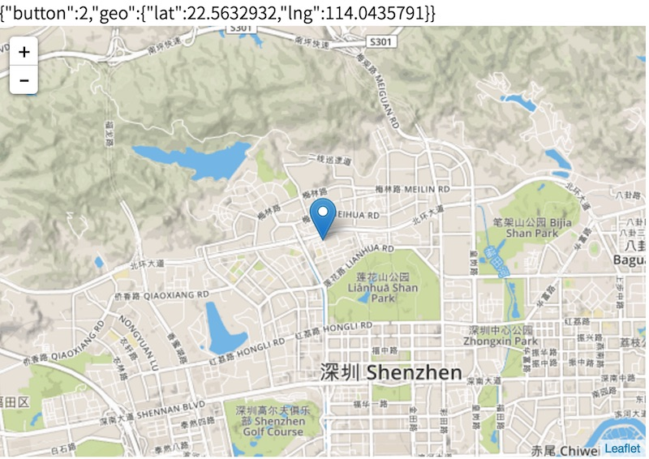

# visitor-in-map

> Display Geo Point to Map


Setup:

```shell
npm install
node index.js
```

格式：

```javascript
{
    "button":2,
    "geo":{
        "lat":22.5632932, 
        "lng": 114.0435791
    }
}
```

Screenshot:


